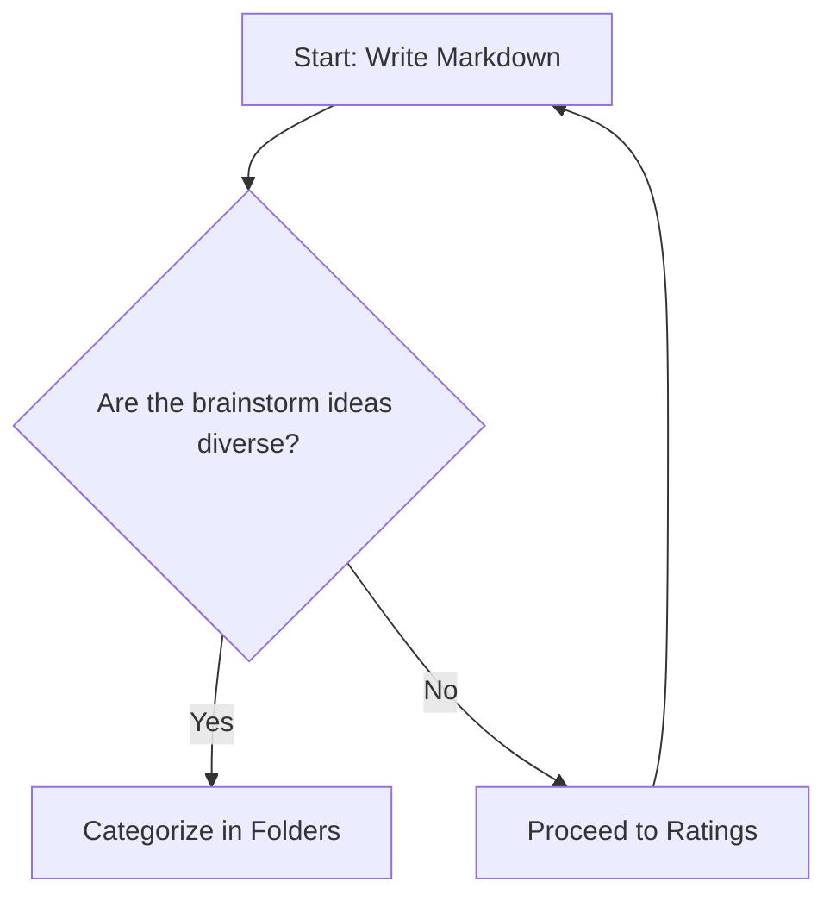

# Why a Knowledge Base?

You might be wondering why would you want a knowledge base (KB), when the documentation of your software (including SaaS) can be contained in a standard PDF file. In this article
 you will learn why a knowledge base is a superior approach to software documentation.

## 1. Continuous Updates and Version Control

In a Continuous Integration/Continuous Deployment workflow, documentation must evolve alongside your code to prevent mismatches.
 The Docs-as-Code approach manages your KB in a Git repository like GitHub, allowing team members to draft and 
 test updates in separate branches before merging them into production. This setup provides complete version control, 
 tracking history and comments so you can easily audit changes or roll back versions. Ultimately, treating documentation as code
  ensures users always access accurate, up-to-date information that matches your latest software releases.


## 2. Display Adaptiveness and Dark Theme

Since the knowledge base renders on the browser as a webpage, the display is adaptive and displays according to the device screen and the browser preferences.
It is easy to switch between dark and light themes.


## 3. Multimedia and Responsiveness.

Markdown allows to embed different types of media, including videos, youtube, animated gifs, json diagrams, etc.

Embedded mp4 video example (the video file is located inside the KB github repo, this means the media from each section is stored within its corresponding folder)

<video controls width="100%">
  <source src={require('./img/video.mp4').default} type="video/mp4" />
  Your browser does not support the video tag.
</video>

This is an animaged gif image (833 Kbs)


## LLM Ready

LLMs like ChatGPT and Gemini learn about software by processing websites and user manuals. While they accept various file types, they prefer Markdown because it is machine-readable and explicitly structures knowledge hierarchy and priority.

Key advantages of Markdown for LLMs:

Image Context: Models can read alt tags to reference images even if they aren't multimodal.

LLM-Specific Instructions: Allows embedding notes and guidance directly for model interpretation.

Metadata Support: Easily incorporates SEO tags and markers for crawlers and indexers.

Learn more at: [Why Markdown is the Best Format for LLMs](https://medium.com/@wetrocloud/why-markdown-is-the-best-format-for-llms-aa0514a409a7)


## Artifacts

In a knowledge base that uses markdown it is possible to embed dynamic artifacts, for example: 

### Accordions

<details>
  <summary>Click here to expand and read more</summary>

  This is the hidden content inside the accordion. You can put text, bullet points, or even images here:

  - Item one
  - Item two

</details>


### Callouts

:::note
This is a standard note callout to highlight important information.
:::

:::tip
Here is a helpful tip or best practice you can share with users.
:::

:::info
Use an info callout for general supplementary details.
:::

:::warning
Be careful! This warns the user about a potential pitfall or breaking change.
:::

:::danger
Critical warning! Use this for dangerous actions or destructive steps.
:::


### Mermaid Diagrams

The following diagram is not an image, it is code and it can be understood by llms and other machines



### Code Blocks
If you need to communicate code that can be easily copy and pasted 

```javascript
function greetUser(name) {
  console.log("Hello, " + name + "!");
}
greetUser("Developer");
```

### HTML and JS reacy

This knowledge base uses [MDX](https://mdxjs.com/docs/what-is-mdx/), which allows you to mix Markdown, raw HTML, and JavaScript right inside the article.

#### A . Standard HTML Styling
You can use standard HTML tags with inline styles:

<div style={{ padding: '16px', backgroundColor: '#eef2ff', borderRadius: '8px', borderLeft: '4px solid #4f46e5', margin: '20px 0' }}>
  <p style={{ margin: 0, color: '#1e1b4b' }}>
    <strong>HTML Box:</strong> This element is written using raw HTML and CSS directly inside the Markdown file.
  </p>
</div>

#### B. Interactive JavaScript / Scripts
You can also attach event handlers and JavaScript functionality using JSX syntax:

<button 
  onClick={() => alert('Hello! This script ran directly from your Docusaurus markdown file.')}
  style={{ padding: '10px 20px', backgroundColor: '#25c2a0', color: '#fff', border: 'none', borderRadius: '6px', cursor: 'pointer', fontWeight: 'bold' }}
>
  Click This Script Button
</button>


## Batch edits

Since the documentation is code, you can edit it using code tools like Find and Replace.
In the following image I'm replacing the word 'demo' with 'trial' across all articles in the knowledge base


## Navigation and knowledge hierarchy

If you are reading this page using a computer, you are able to see a navigation bar on the left which holds all the Sections, you can open a section 
and then see all its corresponding articles. On the right side you will see a floating transparent map  which allows you to easily
move between the sections in the article.


## LLM Assistant Ready

The latest stable release of Chrome (and many other browsers) now include an llm assistant that helps the user "talk" with
the webpage, the technology behind the articles in this website (markdown, html static site) makes it very effective for the llm assistant to understand 
the content (it can read the alt tags, for example).


## Article sharing and interlinking

Very easy for hosts and trainers to share specific sections of the knowledgebase

(image here of a "share this" button)


## Analytics

Know which are the most reviewed articles and sections of the documentation. In the case of this knowledge base I have placed a Google Analytics Tag , so on my GA4 dashboard
I can see which audiences are visiting, where they are landing, what they consult. 


Also you can get instant feedback from the user's experience with the "Was this useful" widget, so you can implement a natural selection evolution approach to the curation of the knowledge base.
Find the vote option at the bottom of the article, the button then can fire a webhook, or save an entry to a mini database (there are several methods available to track the click)
