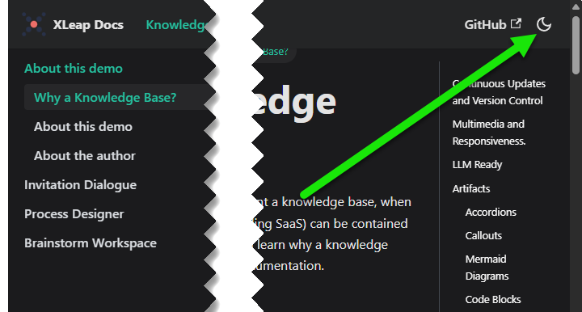
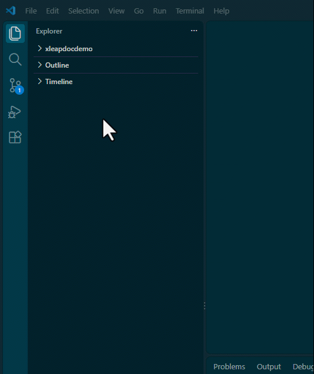
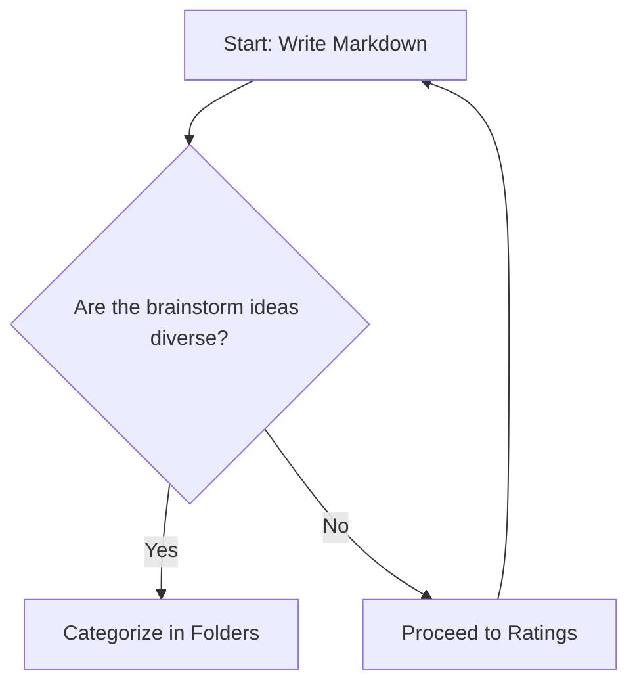
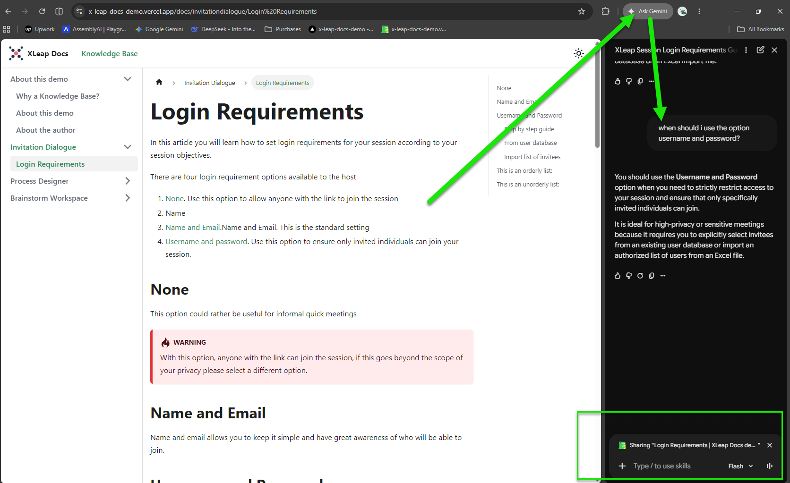
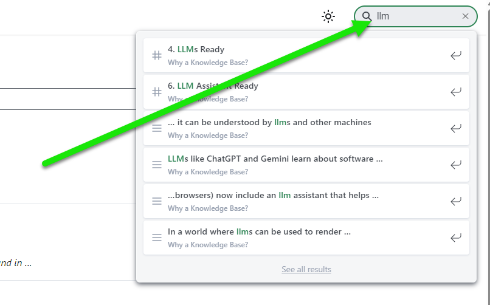
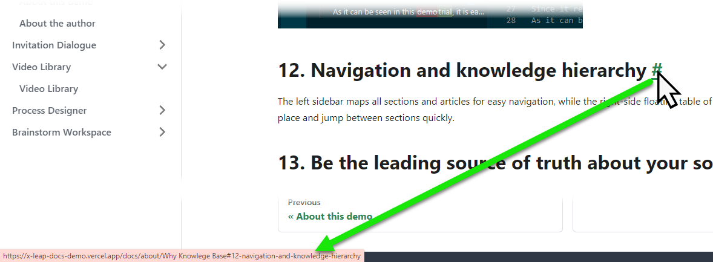
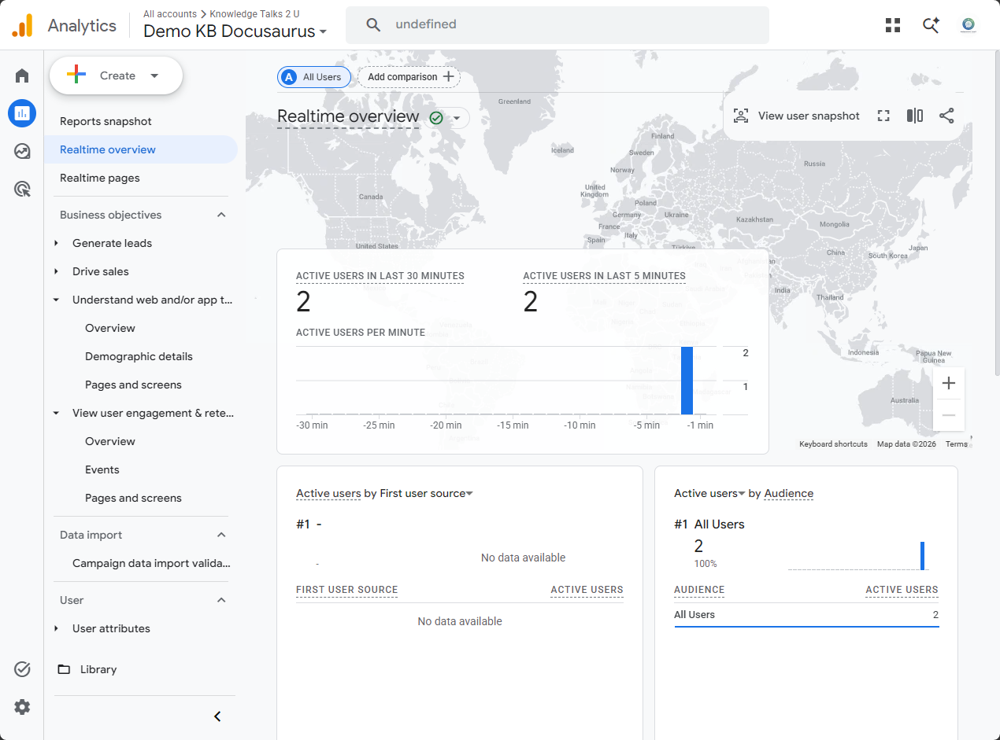
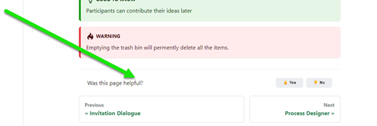
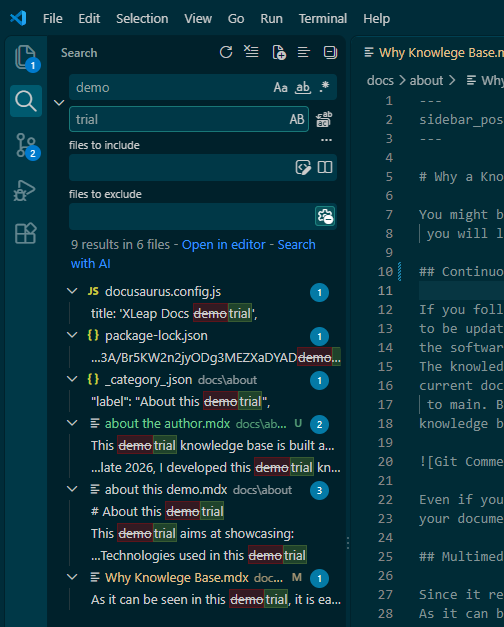

# Why a Knowledge Base?

You might be wondering why would you want a knowledge base (KB), when the documentation of your software can be contained in a standard PDF file. In this article
 you will learn why a knowledge base is a superior approach to software documentation.  
      
If you need further persuasion points visit [this article](https://www.atlassian.com/itsm/knowledge-management/what-is-a-knowledge-base) from Atlassian.


## 1. Continuous Updates and Version Control

In a Continuous Integration/Continuous Deployment workflow, documentation must evolve alongside your code to prevent mismatches.
 The Docs-as-Code approach manages your KB in a Git repository like GitHub, allowing team members to draft and 
 test updates in separate branches before merging them into production. This setup provides complete version control, 
 tracking history and comments so you can easily audit changes or roll back versions. Ultimately, treating documentation as code
  ensures users always access accurate, up-to-date information that matches your latest software releases.


## 2. Display Adaptiveness and Dark Theme

Since the KB renders on the browser as a webpage, the display is adaptive and displays according to the device screen and the browser preferences.
It is easy to switch between dark and light themes.



## 3. Embedded Multimedia Artifacts

Markdown allows to embed different types of media, including videos, youtube, animated gifs, json diagrams, etc. 
The resources can be internal or pulled from third parties.

The following is an embedded mp4 video (the video file is located inside the KB github repo)

<video controls width="100%">
  <source src={require('./img/video.mp4').default} type="video/mp4" />
  Your browser does not support the video tag.
</video>

The following is an animaged gif image (833 Kbs in size)



It is also possible to have "cards" appearing at specific timestamps during the reproduction of the video, such cards can have links to other videos
or articles in the KB, in case you want, for example, to tell the viewers to watch a different video first. To see an example of such scenario, visit
the [video library section](https://x-leap-docs-demo.vercel.app/docs/videolibrary/Video%20Library). 


## 4. LLMs Ready

LLMs like ChatGPT and Gemini learn about software by processing websites and user manuals. While they learn from various file types, they prefer Markdown language, since it is machine-readable and explicitly structures knowledge hierarchy and mark up.
Key advantages of Markdown for LLMs:

- Image Context: Models can read alt tags to reference images even if they aren't multimodal.

- LLM-Specific Instructions: Allows embedding notes and guidance directly for model interpretation.

- Metadata Support: Easily incorporates SEO tags and markers for crawlers and indexers.

Learn more at: [Why Markdown is the Best Format for LLMs](https://medium.com/@wetrocloud/why-markdown-is-the-best-format-for-llms-aa0514a409a7)


## 5. Artifacts

In a knowledge base that uses markdown it is possible to embed dynamic artifacts, for example: 

### 5.1 Accordions

<details>
  <summary>Click here to expand and read more</summary>

  This is the hidden content inside the accordion. You can put text, bullet points, or even images here:

  - Item one
  - Item two

</details>


### 5.2 Callouts

:::note
This is a standard note callout to highlight important information.
:::

:::tip
Here is a helpful tip or best practice you can share with users.
:::

:::info
Use an info callout for general supplementary details.
:::

:::warning
Be careful! This warns the user about a potential pitfall or breaking change.
:::

:::danger
Critical warning! Use this for dangerous actions or destructive steps.
:::


### 5.3 Mermaid Diagrams

The following diagram is not an image, it is code and it can be understood by llms and other machines



### 5.4 Code Blocks
If you need to communicate code that can be easily copy and pasted 

```javascript
function greetUser(name) {
  console.log("Hello, " + name + "!");
}
greetUser("Developer");
```

### 5.5 HTML and JS ready

This knowledge base uses [MDX](https://mdxjs.com/docs/what-is-mdx/), which allows you to mix Markdown, raw HTML, and JavaScript right inside the article.

#### A . Standard HTML Styling
You can use standard HTML tags with inline styles:

<div style={{ padding: '16px', backgroundColor: '#eef2ff', borderRadius: '8px', borderLeft: '4px solid #4f46e5', margin: '20px 0' }}>
  <p style={{ margin: 0, color: '#1e1b4b' }}>
    <strong>HTML Box:</strong> This element is written using raw HTML and CSS directly inside the Markdown file.
  </p>
</div>

#### B. Interactive JavaScript / Scripts
You can also attach event handlers and JavaScript functionality using JSX syntax:

<button 
  onClick={() => alert('Hello! This script ran directly from your Docusaurus markdown file.')}
  style={{ padding: '10px 20px', backgroundColor: '#25c2a0', color: '#fff', border: 'none', borderRadius: '6px', cursor: 'pointer', fontWeight: 'bold' }}
>
  Click This Script Button
</button>

## 6. LLM Assistant Ready

The latest stable release of Chrome (and many other browsers) now include an llm assistant that helps the user "talk" with
the webpage, the technology behind the articles in this website (markdown, html static site) makes it very effective for the llm assistant to understand 
the content (it can read the alt tags, for example).



## 7. Searchability and "shareability"

It is easy to integrate local search in the KB using React components. You can test it now, it searches across all articles in the knowledge base:



In addition to local search functionality, Google will index the KB considering the knowledge hierarchy
 established in the sitemap.xml file that is automatically generated by docusaurus on every build run . 
 [View the sitemap](https://x-leap-docs-demo.vercel.app/sitemap.xml)
  
  
  To share knowledge, instead of sharing a link to the KB, share a link to a specific section in a specific article. To do this, simply copy the anchor link found at the end of each heading.  
  
  

## 8. Analytics

Know which are the most reviewed articles and sections of the documentation. In the case of this knowledge base I have placed a Google Analytics Tag , so on my GA4 dashboard
I can see which audiences are visiting, where they are landing, what they consult. 


Also you can get instant feedback from the user's experience with the "Was this useful" widget, so you can implement a natural selection evolution approach to the curation of the knowledge base.
Find the vote option at the bottom of the article, the button then can fire a webhook, or save an entry to a mini database (there are several methods available to track the click)


## 9. Data Sovereignty 

This KB relies entirely on open-source technologies, meaning no third party controls its display or vendor-locks your content. 

Unlike commercial platforms such as **[Readme](https://readme.io)** and **[GitBook](https://www.gitbook.com)**—which force you to depend 
on proprietary hosting and tooling—the system generating this KB runs locally on your computer. You retain complete ownership and can 
migrate your hosting provider or deploy to any cloud compute or container platform at any time.

## 11 . Batch edits

Since the documentation is code, you can edit it using code tools like Find and Replace.
In the following image I'm replacing the word 'demo' with 'trial' across all articles in the knowledge base



## 12. Navigation and knowledge hierarchy

The left sidebar maps all sections and articles for easy navigation, while the right-side floating table of contents 
helps you track your place and jump between sections quickly.


## 13. Be the leading source of truth for your software (draft)

In a world where llms can be used to render stories that caters to the interests of whoever is using them, an official knowledge base is perhaps the best way have editorial control
over the way your product is explained to the world. Develop the arguments that support your claims so that users can understand not only the functioning of the software, 
but the principles behind its design. A KB can be much more than a users manual, it can be used to lay out the argument of why people should use the software.
effectively using it as a place that advances the argument of your value proposition.
For example, in the case of XLeap, the KB can be the place where people get to learn why anonimity when sharing ideas during a collaborative meeting will result in 
better meeting results.

## 14. Smooth integration to your customer service/client success pipeline.

To reduce the volume of support tickets, have your users first consult the Knowledge Base, and after using the search engine (or a support chatbot) they will check an article
only if the article/chatbot was unable to be useful route the user to a ticket system for personal support. Then you are able to know which articles they read and determine 
why is it that the article wasn't enough.


