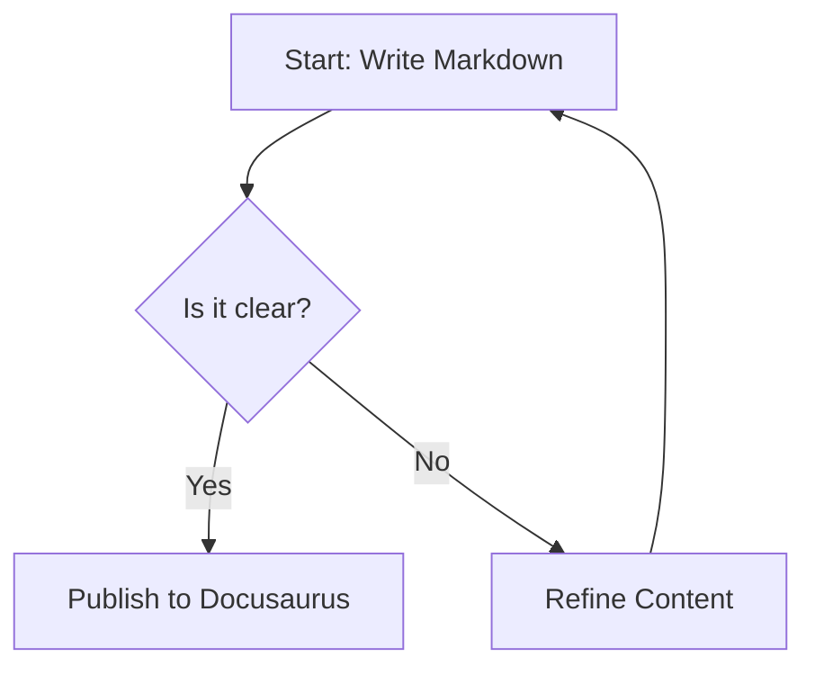

# Why a Knowledge Base?

You might be wondering why would you want a knowledge base, when the documentation of your software (including SaaS) can be contained in a standard PDF file. In this article
 you will learn why a knowledge base is a superior approach to software documentation.

## CI/CD 

If you follow a Continuous Integration - Continuous Deployment approach for your software project you are constantly updating your code and consequently your documentation needs
to be updated as well, ideally the very same moment the code is deployed to production. You don't want to have a mismatch between the documentation and the latest version of
the software in production. Docs-as-Code is a neat approach that ensures coherence in the experience of the user of the software and the user of the documentation.
The knowledge base files are contained in a git repository, in this example I'm using GitHub. This allows team members to create  new branches to develop changes in the 
current documentation without altering the main branch with the latest stable files. Once the changes are complete and tested, the knowledge base manager can merge the changes
 to main. By using git and github there is great control over changes made throughout time, allowing to quickly correct a change or roll back to an entire different version of the
knowledge base. Every change that is committed is commented so that there is clarity on what the change is, who made it, and what was its purpose.


Even if you are not deploying new changes often,  treating your documentation as code allows tight version control and ensures your users are always accessing the latest version of
your documentation. 

## Multimedia and Responsiveness.

Since it renders on the browser as a webpage, the display is adaptive and displays according to the device screen and the browser preferences of the users.
As it can be seen in this demo, it is easy to switch between dark and light themes.
It allows to use different types of media, including embedded videos, youtube videos, images, diagrams, audio files, etc.

Embedded mp4 video example (the video file is located inside the github repo)

<video controls width="100%">
  <source src={require('./img/video.mp4').default} type="video/mp4" />
  Your browser does not support the video tag.
</video>


## LLM Ready

Llms like ChatGPT and Gemini are trained to incorporate knowledge about your software by processing your website and user manuals, and while you can use many text file formats
llms prefer documentation written in markdown, markdown is machine readable and llms can make sense of it more easily, llms can read the alt tags for the images so that in case
a model was not trained with images, it at least can reference the images in the markdown files. 
Additionally, using markdown it is possible to include in the documentation notes and instructions specific for the interpretation of the llms, as well as tags for SEO and markers
for other crawlers and indexers. Markdown is excellent to define the hierarchy of the knowledge and emphasize to machines what is most urgent to consider.

[Why Markdown is the Best Format for LLMs](https://medium.com/@wetrocloud/why-markdown-is-the-best-format-for-llms-aa0514a409a7)


## Artifacts

In a knowledge base that uses markdown it is possible to embed dynamic artifacts, for example: 

1. The "learn more" accordion:

<details>
  <summary>Click here to expand and read more</summary>

  This is the hidden content inside the accordion. You can put text, bullet points, or even images here:

  - Item one
  - Item two

</details>


2. Callouts for warnings, caution, etc:

:::note
This is a standard note callout to highlight important information.
:::

:::tip
Here is a helpful tip or best practice you can share with users.
:::

:::info
Use an info callout for general supplementary details.
:::

:::warning
Be careful! This warns the user about a potential pitfall or breaking change.
:::

:::danger
Critical warning! Use this for dangerous actions or destructive steps.
:::


### 3. Mermaid Diagrams

The following diagram is not an image, it is code and it can be understood by llms and other machines



### 4. Code Blocks
If you need to communicate code that can be easily copy and pasted 

```javascript
function greetUser(name) {
  console.log("Hello, " + name + "!");
}
greetUser("Developer");
```

