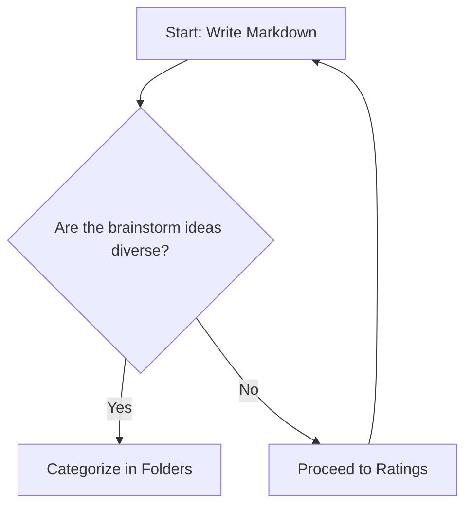

# Why a Knowledge Base?

You might be wondering why would you want a knowledge base, when the documentation of your software (including SaaS) can be contained in a standard PDF file. In this article
 you will learn why a knowledge base is a superior approach to software documentation.

## Continuous Updates and Version Control

<details>
  <summary>Click here to expand and read more</summary>

In a Continuous Integration/Continuous Deployment workflow, documentation must evolve alongside your code to prevent mismatches.
 The Docs-as-Code approach manages your knowledge base in a Git repository like GitHub, allowing team members to draft and 
 test updates in separate branches before merging them into production. This setup provides complete version control, 
 tracking history and comments so you can easily audit changes or roll back versions. Ultimately, treating documentation as code
  ensures users always access accurate, up-to-date information that matches your latest software releases.


</details>


## Display Adaptiveness.

<details>
  <summary>Click here to expand and read more</summary>

Since it renders on the browser as a webpage, the display is adaptive and displays according to the device screen and the browser preferences of the users.
As it can be seen in this demo, it is easy to switch between dark and light themes.
It allows to use different types of media, including embedded videos, youtube videos, images, diagrams, audio files, etc.

Embedded mp4 video example (the video file is located inside the github repo)

<video controls width="100%">
  <source src={require('./img/video.mp4').default} type="video/mp4" />
  Your browser does not support the video tag.
</video>

</details>


## Multimedia and Responsiveness.

<details>
  <summary>Click here to expand and read more</summary>

Since it renders on the browser as a webpage, the display is adaptive and displays according to the device screen and the browser preferences of the users.
As it can be seen in this demo, it is easy to switch between dark and light themes.
It allows to use different types of media, including embedded videos, youtube videos, images, diagrams, audio files, etc.

Embedded mp4 video example (the video file is located inside the github repo)

<video controls width="100%">
  <source src={require('./img/video.mp4').default} type="video/mp4" />
  Your browser does not support the video tag.
</video>

</details>


## LLM Ready

<details>
  <summary>Click here to expand and read more</summary>

Llms like ChatGPT and Gemini are trained to incorporate knowledge about your software by processing your website and user manuals, and while you can use many text file formats
llms prefer documentation written in markdown, markdown is machine readable and llms can make sense of it more easily, llms can read the alt tags for the images so that in case
a model was not trained with images, it at least can reference the images in the markdown files. 
Additionally, using markdown it is possible to include in the documentation notes and instructions specific for the interpretation of the llms, as well as tags for SEO and markers
for other crawlers and indexers. Markdown is excellent to define the hierarchy of the knowledge and emphasize to machines what is most urgent to consider.

[Why Markdown is the Best Format for LLMs](https://medium.com/@wetrocloud/why-markdown-is-the-best-format-for-llms-aa0514a409a7)

</details>


## Artifacts

<details>
  <summary>Click here to expand and read more</summary>

In a knowledge base that uses markdown it is possible to embed dynamic artifacts, for example: 

### Accordions

<details>
  <summary>Click here to expand and read more</summary>

  This is the hidden content inside the accordion. You can put text, bullet points, or even images here:

  - Item one
  - Item two

</details>


### Callouts

:::note
This is a standard note callout to highlight important information.
:::

:::tip
Here is a helpful tip or best practice you can share with users.
:::

:::info
Use an info callout for general supplementary details.
:::

:::warning
Be careful! This warns the user about a potential pitfall or breaking change.
:::

:::danger
Critical warning! Use this for dangerous actions or destructive steps.
:::


### Mermaid Diagrams

The following diagram is not an image, it is code and it can be understood by llms and other machines



### Code Blocks
If you need to communicate code that can be easily copy and pasted 

```javascript
function greetUser(name) {
  console.log("Hello, " + name + "!");
}
greetUser("Developer");
```

### HTML and JS reacy

This knowledge base uses [MDX](https://mdxjs.com/docs/what-is-mdx/), which allows you to mix Markdown, raw HTML, and JavaScript right inside the article.

#### A . Standard HTML Styling
You can use standard HTML tags with inline styles:

<div style={{ padding: '16px', backgroundColor: '#eef2ff', borderRadius: '8px', borderLeft: '4px solid #4f46e5', margin: '20px 0' }}>
  <p style={{ margin: 0, color: '#1e1b4b' }}>
    <strong>HTML Box:</strong> This element is written using raw HTML and CSS directly inside the Markdown file.
  </p>
</div>

#### B. Interactive JavaScript / Scripts
You can also attach event handlers and JavaScript functionality using JSX syntax:

<button 
  onClick={() => alert('Hello! This script ran directly from your Docusaurus markdown file.')}
  style={{ padding: '10px 20px', backgroundColor: '#25c2a0', color: '#fff', border: 'none', borderRadius: '6px', cursor: 'pointer', fontWeight: 'bold' }}
>
  Click This Script Button
</button>

</details>


## Batch edits

<details>
  <summary>Click here to expand and read more</summary>

Since the documentation is code, you can edit it using code tools like Find and Replace.
In the following image I'm replacing the word 'demo' with 'trial' across all articles in the knowledge base


</details>


## Navigation and knowledge hierarchy

<details>
  <summary>Click here to expand and read more</summary>

If you are reading this page using a computer, you are able to see a navigation bar on the left which holds all the Sections, you can open a section 
and then see all its corresponding articles. On the right side you will see a floating transparent map  which allows you to easily
move between the sections in the article.

### Dark theme Ready

Users can easily switch to the dark theme


</details>