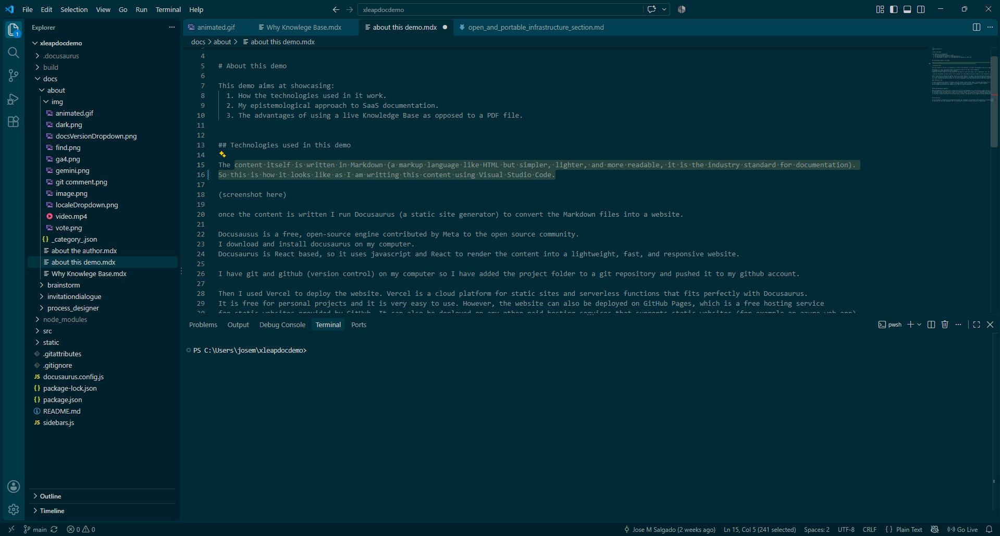
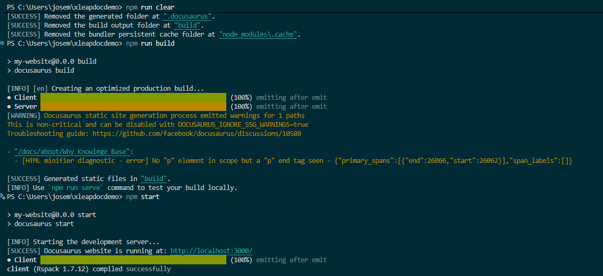
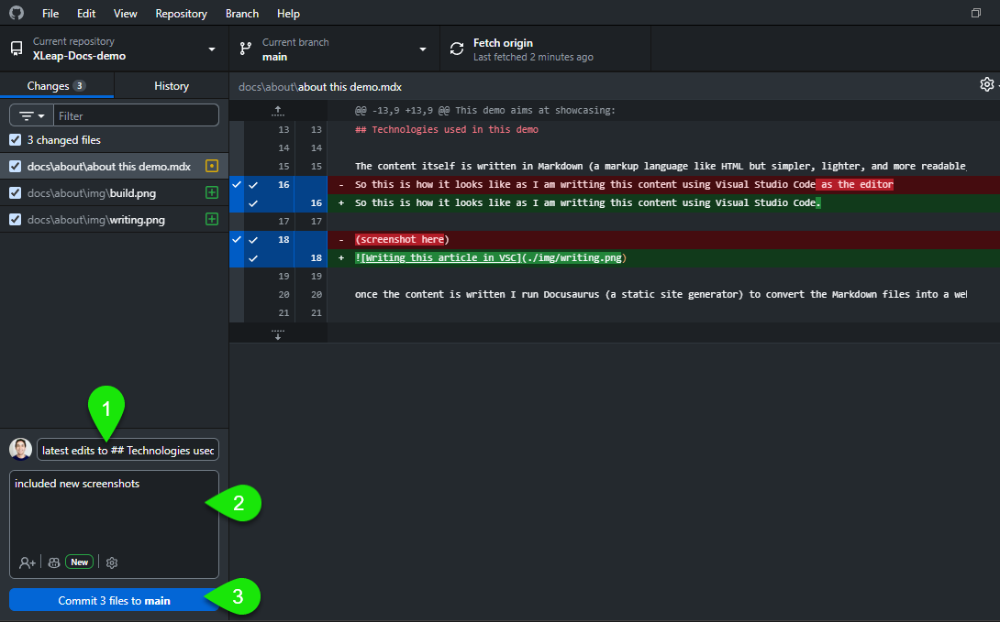
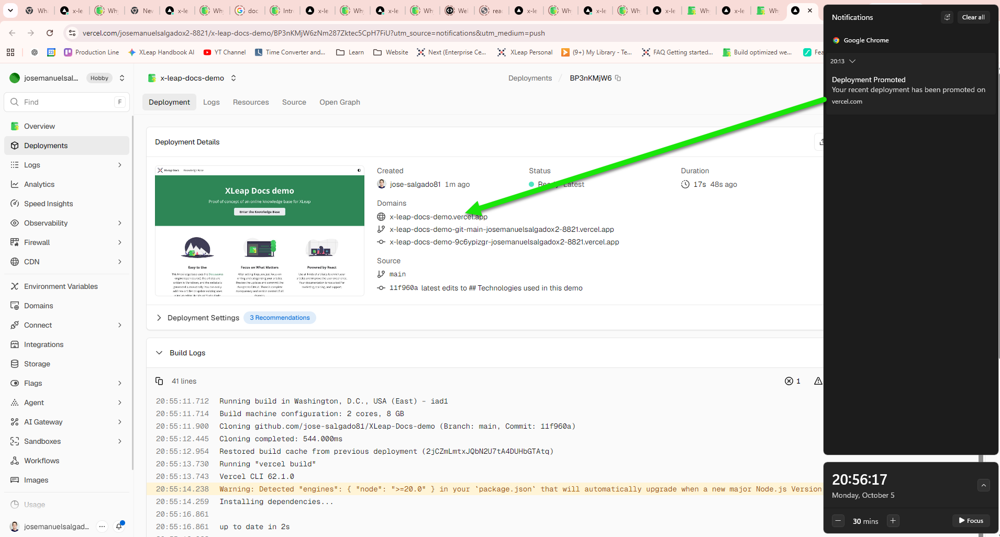

# About this demo

This demo aims at showcasing:
  1. How the technologies used in it work. 
  2. My epistemological approach to SaaS documentation.
  3. The advantages of using a live Knowledge Base as opposed to a PDF file.
 

## Production pipeline (processes) 

### Step 1. Write an article in markdown

The content is written in [Markdown](https://www.markdownguide.org/getting-started/) (a markup language like HTML but simpler, lighter, and more readable, it is the industry standard for documentation).
So this is how it looks like as I am writting this article using Visual Studio Code:

### Step 2. Run Build on terminal and preview changes locally (docusaurus engine)

Docusausus is a free, open-source static site engine contributed by Meta to the open source community. 
I download and install docusaurus on my computer.
Docusaurus is React based, so it uses javascript and React to render the content into a lightweight, fast, and responsive website.

once the content is written in markdown I run Docusaurus:

### Step 3. Push changes to GitHub

I have git and github (version control) on my computer so I have added the project folder to a git repository and pushed it to my github account.
I comment each commit in case it is necessary to roll back the specific changes in this commit.

### Step 4. Vercel deployment server updates automatically to new release.

So finally I used Vercel to deploy the website. Vercel is a cloud platform for static sites and serverless functions that fits perfectly with Docusaurus. 
It is free for personal projects and it is very easy to use. However, the website can also be deployed on any other free or paid hosting service that supports static websites (for example an azure web app).

### Production Flow

I create documentation content in markdown, save the changes (Visual Studio Code). I preview the changes in my local environment (Docusaurus). 
If the changes are satisfactory, I commit the changes to git (git) and push the changes to github (github).
Vercel automatically detects the changes in the repo and rebuild the website.

## My epistemological approach

While docummenting every feature of a software as if it were the dashboard of a machine (every single function) is one acceptable approach, 
in SaaS there is an increasing focus on real life usability (How do I do x) which is to be concerned with the intention of the user accessing the Knowledge Base. (what do they want?)
It is highly likely they dont want to read it as if it were a book, but rather they have a specific problem they want to solve,
so articles on popular questions can be useful (How to create a new session, How to require username and password to access a session, etc.)

## Architecture

Using the industry standards of knowledge base design (eg. the Google  documetation style guide https://developers.google.com/style), same for microsoft, etc.
we see that the left side navigation bar is a great way to structure sections and then its subsections.

## Disclaimer

This demo site is a proof of concept and not an official channel from XLeap Gmbh, please visit [https://www.xleap.net/](https://www.xleap.net/)