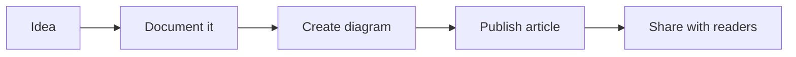
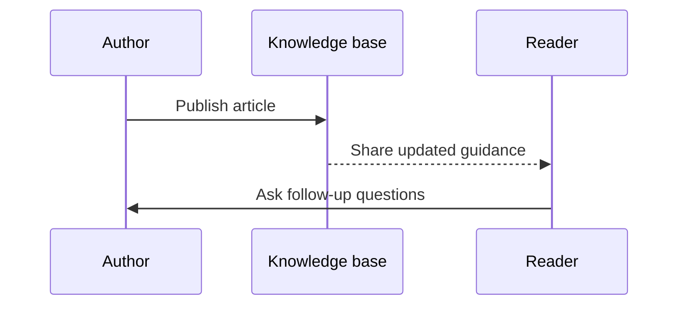

Mermaid lets you describe diagrams as simple text and render them into visual flowcharts, sequence diagrams, and more.

This is especially useful when you want to explain a process or architecture directly inside your documentation.

## Why use Mermaid?

- Simple syntax that lives in the same markdown file as the content
- Easy to maintain alongside documentation updates
- Great for process flows, architecture diagrams, and decision trees

## Example: a content workflow

Mermaid keeps visual explanations lightweight and readable, which makes it a good fit for a knowledge base that needs both clarity and speed.
