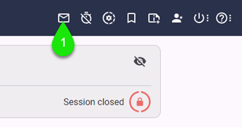
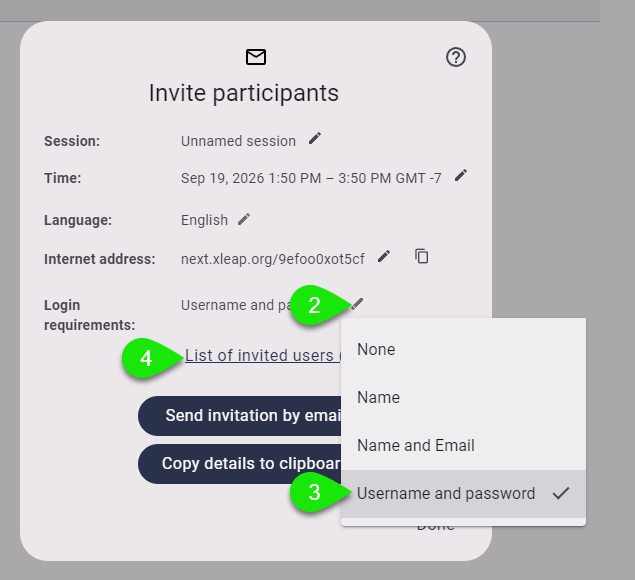
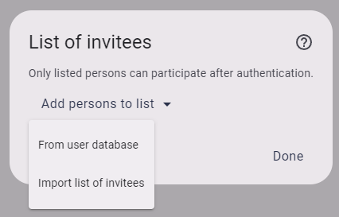
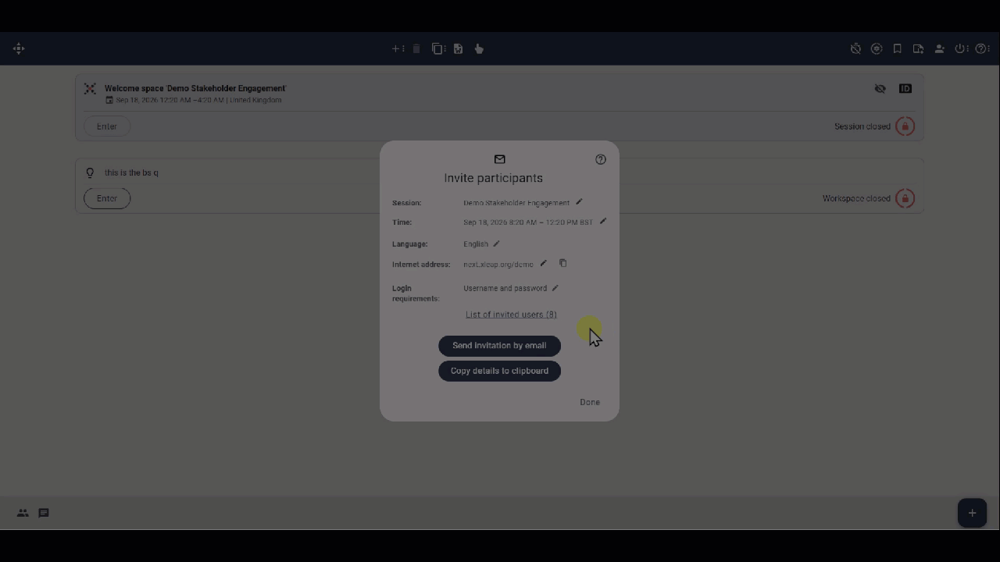
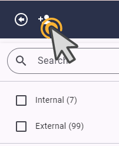

In this article you will learn how to set login requirements for your session according to your session objectives.

There are four login requirement options available to the host 

1. [None](#none). Use this option to allow anyone with the link to join the session
2. Name
3.  [Name and Email](#name-and-email).Name and Email. This is the standard setting
4. [Username and password](#username-and-password). Use this option to ensure only invited individuals can join your session. 

## None

This option could rather be useful for informal quick meetings

:::danger[Warning]

With this option, anyone with the link can join the session, if this goes beyond the scope of your privacy please select a different option.

:::

## Name and Email
Name and email allows you to keep it simple and have great awareness of who will be able to join.   

## Username and Password
Setting username and password as a login requirement allows you select specific invitees from a user database or import them from an Excel file. 
This is perhaps the most restrictive login requirement option. 

### Step by step guide
1. Within the session, click the invitation dialogue button on the toolbar

2. On **Login requirements**, click the edit option
3. Select **Username and password**
4. If you are ready to apoint your invitees, click **List of invited users**

This will bring the List of Invitees dialogue from which you can choose from two options, [From user database](#from-user-database) and [Import-list-of-invited-users](#importlist) 

### From user database
Selecting to add from user database will allow you to filter and find specific individuals from the database.

 contact center admin for changes to this database, note that you can add new users by clicking on Add User 

### Import list of invitees
This option allows you to import from an Excel file

#### This is an H4 level

This is **bold**, this is _italic_ 

## This is an orderly list:

1. Item 1
2. Item 1
3. Item 1
4. Item 4

## This is an unorderly list:

- Item 1
- Item 2
- Item 3
- Item 4

:::tip[Good to know]

Participants can contribute their ideas later

:::

:::danger[Warning]

Emptying the trash bin will permently delete all the items.

:::