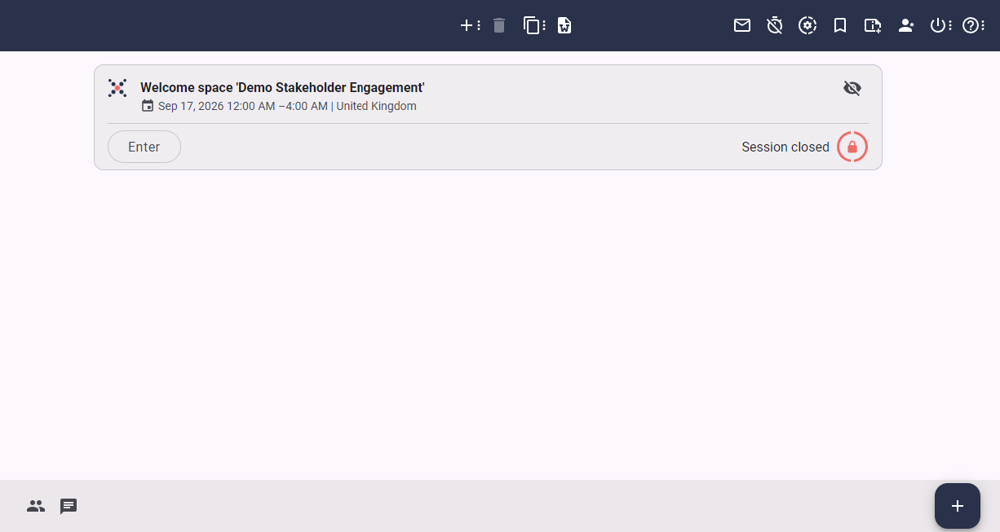

# Intro to Process Designer

The Process designer is for creating, customizing and navigating the process of the session. 

For a newly created session, the Process designer will only show the item of the Welcome space by which participants enter the session. 

Here is an image:

