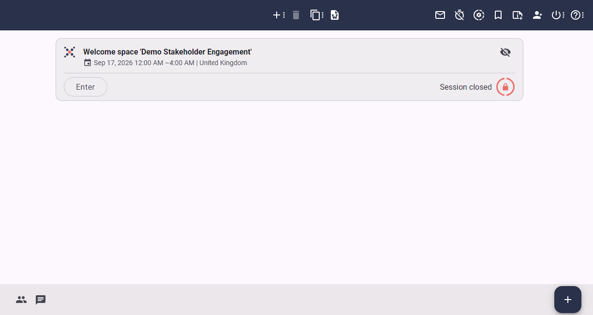

# Intro to Process Designer

The Process designer is for creating, customizing and navigating the process of the session. 

For a newly created session, the Process designer will only show the item of the Welcome space by which participants enter the session. 

Here is an image:

## This is an H2 level heading

### This is an H3 level 

#### This is an H4 level

This is **bold**, this is _italic_ 

## This is an orderly list:

1. Item 1
2. Item 1
3. Item 1
4. Item 4

## This is an unorderly list:

- Item 1
- Item 2
- Item 3
- Item 4

:::tip[Good to know]

Participants can contribute their ideas later

:::

:::danger[Warning]

Emptying the trash bin will permently delete all the items.

:::